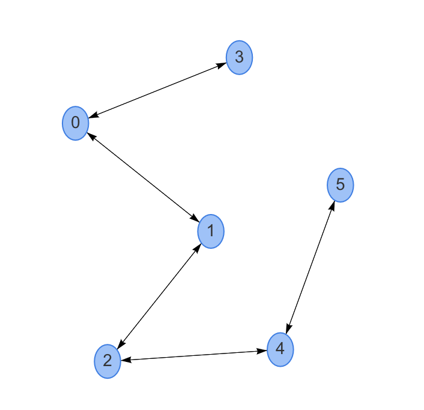

# Graph Alogrithm

1. search for the frame by searching in depth (DFST)

    Example 1.
    
    Matrix: 
    0 1 0 1 0 0 
    1 0 1 1 0 1   
    0 1 0 0 1 1  
    1 1 0 0 0 1  
    0 0 1 0 0 1  
    0 1 1 1 1 0  
    
    
    
    Start vertex : 2 
    
    
    
    Start vertex : 3
    
    
    
    